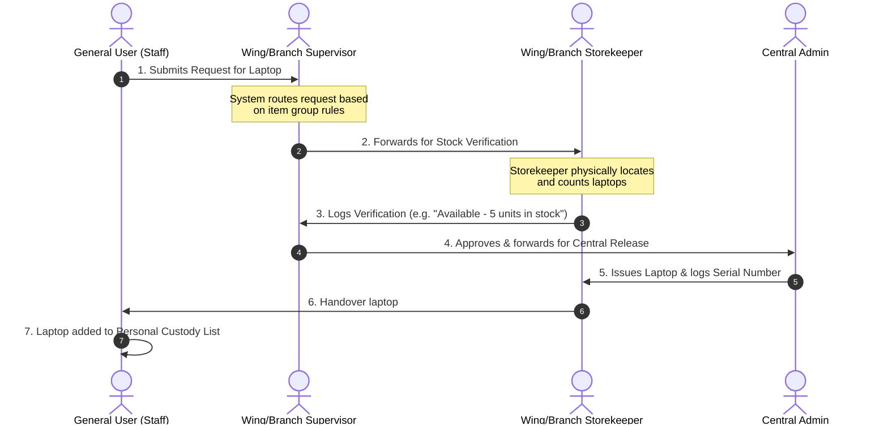
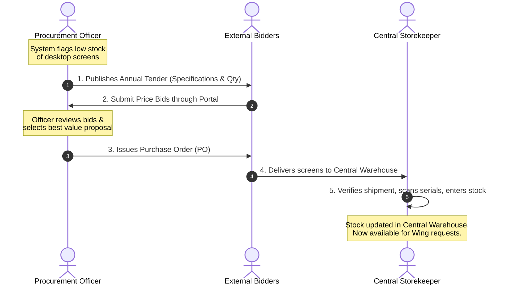

# 📦 Inventory Management System (IMS)
## Executive System Overview & Presentation Guide

Welcome to the **Inventory Management System (IMS)**. This guide is designed for presentation to executive leadership. It explains the system's core purpose, business value, user roles, and workflows using simple, layman-friendly language and clear visual diagrams.

---

## 1. What is the IMS? (The 2-Minute Pitch)

Imagine your organization’s physical assets and supplies (computers, office furniture, stationeries, tools) as books in a massive library. Currently, checking out a book, buying new ones, or tracking who has which book requires piles of paperwork, manual signatures, and phone calls. 

**The IMS digitizes this entire process.** 

It is an enterprise-grade web application that manages the entire lifecycle of your organization's physical inventory:
1. **Acquiring stock** (tenders, vendor bids, purchase orders, and central deliveries).
2. **Holding stock** across three levels of storage (central warehouse, department store, and individual desks).
3. **Issuing stock** through an automated, role-based approval chain.
4. **Accountability & Returns** (knowing exactly who holds what item, returning unused goods, and generating instant audit reports).

### Why the Organization Needs It:
* **Eliminates Paperwork:** Manual request forms and physical logs are replaced by a secure, instant dashboard.
* **Prevents Waste:** Real-time tracking prevents departments from ordering items that are already sitting unused in another wing.
* **Ironclad Accountability:** The system tracks the complete custody of every single item—from the supplier's delivery truck to the specific desk it belongs to.
* **Audit Ready:** Every approval, transfer, and transaction is permanently logged for auditor review.

---

## 2. The Three-Level Inventory Model

To understand how items move, think of the system as a three-tier pyramid:

```mermaid
flowchart TD
    PersonalStore[Level 1: PERSONAL / BRANCH STORE<br/>Staff Custody / Desks]
    WingStore[Level 2: BRANCH / WING STORE<br/>Department Stock]
    AdminStore[Level 3: ADMIN STORE<br/>Central Warehouse]
    Vendor[External Suppliers / Vendors]
    
    PersonalStore <-->|1. Issuance & returns| WingStore
    WingStore <-->|2. Stock transfers & returns| AdminStore
    AdminStore <--|3. Purchases & deliveries| Vendor
    
    style PersonalStore fill:#fef9c3,stroke:#ca8a04,stroke-width:2px;
    style WingStore fill:#dbeafe,stroke:#2563eb,stroke-width:2px;
    style AdminStore fill:#dcfce7,stroke:#16a34a,stroke-width:2px;
```

| Inventory Level | Layman's Description | Who Controls It? |
| :--- | :--- | :--- |
| **Level 1: Personal / Branch Store** | Items currently issued to, and in the possession of, specific employees (e.g., a laptop at a desk) or a specific branch office. | **General User (Staff member)** |
| **Level 2: Branch / Wing Store** | Department-specific storage rooms. Stock is moved here to be closer to staff who need it. | **Wing Storekeeper / Wing Supervisor** |
| **Level 3: Admin Store** | The main central warehouse where all newly purchased items are received and bulk stock is stored. | **Central Admin / Storekeeper** |

---

## 3. Core "Wow" Features

Here are the best features of the IMS that make it stand out:

* 🔐 **One-Click Secure Login (SSO):** Staff do not need to remember another password. The IMS integrates with the organization's existing **Digital System (DS) SSO**, allowing single-click secure access.
* ⚡ **Dynamic Multi-Lane Approval:** Not all requests are treated the same. A request for a standard notepad is approved instantly, while a request for a high-value server automatically routes through a multi-tier supervisor-to-admin approval lane.
* 📦 **Physical Verification Safeguards:** Before any supervisor approves a request, a Storekeeper is assigned to physically verify that the item exists in the cabinet, preventing "phantom stock" approvals.
* 🔄 **Lifecycle Return Tracking:** Issued items can be returned to the store with a clear history log, perfect for tracking temporary equipment or returning items when staff members transfer or leave.
* 💾 **Immutable Audit Trail ("Soft Delete"):** To prevent fraud or data loss, records are never fully deleted from the database. They are "soft-deleted" (hidden from daily view but fully retrievable in audit logs).

---

## 4. Role-Based Portals (Who Does What?)

The system adjust menus, buttons, and permissions based on who logs in. Here is the complete list of all **13 system roles**, organized by their functions:

### 🖥️ Group A: System Administration
These roles manage the overall software configuration, user profiles, and permission mappings.

* **1. IMS Super Administrator (`IMS_SUPER_ADMIN`)**
  * *Purpose:* Full system access. The only role that can create roles and modify system permissions.
  * *Actions:* Handles user-role assignments, system updates, global configuration, and full data access.
* **2. IMS Administrator (`IMS_ADMIN`)**
  * *Purpose:* General administrative management of the inventory system.
  * *Actions:* Accesses all stock levels, generates organization-wide reports, configures items, and approves high-level requests (does not manage roles).

---

### 🏢 Group B: Local Supervision (Departmental)
These roles are assigned to department managers to oversee localized team members and inventories.

* **3. Wing Supervisor (`WING_SUPERVISOR`)**
  * *Purpose:* Manages wing-level inventory and team approvals.
  * *Actions:* Reviews requests from wing staff, forwards items to the wing storekeeper for verification, and approves wing-level stock issuances.
* **4. Branch Supervisor (`BRANCH_SUPERVISOR`)**
  * *Purpose:* Manages branch-level inventory and team approvals.
  * *Actions:* Approves branch-level requests, tracks stock within their specific branch scope, and reviews branch demand sheets.

---

### 🔗 Group C: Approval Chain Hierarchy (Workflow Approvers)
These roles represent the organizational hierarchy. They approve or forward requests based on item value and categorization.

**Standard Approval Escalation Chain (Top to Bottom):**
> `DG Admin` (Director General) ➔ `DD Admin` (Deputy Director) ➔ `AD Admin` (Assistant Director) ➔ `Transport / Admin Storekeeper` (Central Release)

* **5. AD Admin-I (`AD_ADMIN_I`)**
  * *Purpose:* Assistant Director I level workflow approver.
  * *Actions:* Reviews incoming requests routed to the AD-I tier, signs off on mid-value stock approvals, or escalates them up the chain.
* **6. AD Admin-II (`AD_ADMIN_II`)**
  * *Purpose:* Assistant Director II level workflow approver.
  * *Actions:* Reviews incoming requests routed to the AD-II tier, verifies allocations, and signs off on approvals.
* **7. DD Admin (`DD_ADMIN`)**
  * *Purpose:* Deputy Director level workflow approver.
  * *Actions:* Approves higher-value requests, reviews departmental allocations, and signs off on key assets.
* **8. DG Admin (`DG_ADMIN`)**
  * *Purpose:* Director General level workflow approver.
  * *Actions:* The highest approval tier for high-value organizational purchases and bulk stock releases.
* **9. Transport Supervisor (`TRANSPORT_SUPERVISOR`)**
  * *Purpose:* Transport workflow approver.
  * *Actions:* Approves vehicle parts, fuel logs, and transit-related inventory requests.

---

### 🔑 Group D: Inventory Custodians (Storekeepers)
These roles are the hands-on managers of the physical items at different levels of the organization.

* **10. Storekeeper (`Storekeeper` / `WORKFLOW_STOREKEEPER`)**
  * *Purpose:* Central Storekeeper—manages the central warehouse.
  * *Actions:* Receives external vendor shipments, logs deliveries, updates central stock balances, and releases bulk items to departments.
* **11. Wing Store Keeper (`WING_STORE_KEEPER`)**
  * *Purpose:* Department Storekeeper—manages wing stock.
  * *Actions:* Performs physical counts, verifies item availability on request, and issues items directly to staff in the wing.
* **12. Branch Store Keeper (`BRANCH_STORE_KEEPER`)**
  * *Purpose:* Branch Storekeeper—manages branch stock.
  * *Actions:* Processes approved stock issuance specifically for assigned branch inventory.

---

### 👥 Group E: General Staff
The everyday users of the system requesting stock for daily work.

* **13. General User (`GENERAL_USER`)**
  * *Purpose:* Everyday employee (General Staff).
  * *Actions:* Submits personal stock requests, tracks request status, views personal issued holdings, and returns items.

---

## 5. Dynamic Routing: How Item Groups Drive Approvals

In our IMS, every catalog item is mapped to a specific **Item Group** (from Group 1 to Group 11) based on its category, cost, and sensitivity. Because different groups contain different physical items, the system applies unique workflow paths depending on what is being requested:

* **Item Grouping:** For example, daily items like stationeries are in **Group 4**, computer hardware is in **Group 2**, and high-value servers are in **Group 5**.
* **Automated Workflow Routing:** When a user requests an item, the system automatically detects its group classification.
  * If they request a **Group 2 item (e.g. computer keyboard)**, the workflow follows the path: *Wing Supervisor ➔ DD Admin ➔ AD Admin-I/II ➔ Storekeeper*.
  * If they request a **Group 5 item (e.g. server)**, the system dynamically changes the path to require higher signoffs: *Wing Supervisor ➔ DG Admin ➔ DD Admin ➔ Storekeeper*.

The staff member does not need to select an approval path. The system handles the routing in the background based on the item group, ensuring complete authorization safety.

| Item Group | Approval Workflow Path | Description |
| :--- | :--- | :--- |
| **Group 1** | Wing Supervisor ➔ DD Admin ➔ AD Admin-I / AD Admin-II ➔ Storekeeper | Standard administrative routing |
| **Group 2** | Wing Supervisor ➔ DD Admin ➔ AD Admin-I / AD Admin-II ➔ Storekeeper | Standard hardware routing |
| **Group 3** | Wing Supervisor ➔ Deputy Director ➔ DD Admin ➔ AD Admin-I / AD Admin-II ➔ Storekeeper | Extended chain requiring Deputy Director signoff |
| **Group 4** | Wing Supervisor ➔ DD Admin ➔ AD Admin-I / AD Admin-II ➔ Storekeeper | General supplies routing |
| **Group 5** | Wing Supervisor ➔ DG Admin ➔ DD Admin ➔ Storekeeper | High-level approval chain (via Director General) |
| **Group 6** | Wing Supervisor ➔ DG Admin ➔ DD Admin ➔ Storekeeper | High-level approval chain (via Director General) |
| **Group 7** | Wing Supervisor ➔ DD Admin ➔ AD Admin-I / AD Admin-II ➔ Storekeeper | Specialized technical equipment routing |
| **Group 8** | Wing Supervisor ➔ DD Admin ➔ AD Admin-I | Local tracking (completes at AD Admin-I) |
| **Group 9** | Wing Supervisor ➔ DD Admin ➔ AD Admin-I / AD Admin-II ➔ Storekeeper | General furniture / fixtures routing |
| **Group 10** | Wing Supervisor ➔ DG Admin ➔ DD Admin ➔ Storekeeper | High-security/valuable assets |
| **Group 11** | Wing Supervisor ➔ DG Admin ➔ DD Admin | High-level policy tracking (completes at DD Admin) |

### Key Takeaway for Leadership:
The system is self-governing. An employee requesting standard stationery (e.g. Group 4) follows the localized channels, while high-value assets (e.g. Group 5 or 10) automatically escalate up the hierarchy, requiring approval from the Director General (`DG_ADMIN`) before the central warehouse can release them.

---

## 6. End-to-End Workflows

Here is exactly how the system handles the two most common organizational scenarios:

### Scenario A: A Staff Member Requests a Laptop (Issuance Workflow)



---

### Scenario B: Restocking Low Inventory (Procurement & Tender Workflow)



---

## 7. Executive Talking Points (For Your Boss)

When presenting this system to your boss, focus on these high-level business advantages:

1. **"This system ends the era of manual checklists."**
   * *Talking Point:* Requests, approvals, and inventory counts are linked. A supervisor will never approve a request for an item that is physically unavailable because the system forces a storekeeper count first.
   
2. **"We have absolute clarity on who owns what."**
   * *Talking Point:* We can run a report on any employee in seconds and see every item checked out to them (including serial numbers). This simplifies handovers when staff members leave or transfer.

3. **"We save money by routing requests smartly."**
   * *Talking Point:* By categorizing items into 11 groups, low-value items bypass complex chains to save time, while high-value equipment is locked behind supervisor-to-admin signoffs.

4. **"Procurement is transparent and integrated."**
   * *Talking Point:* Tenders and purchases are fully integrated. We don't just buy items; we track them from the tender bid stage, through the Purchase Order, directly into warehouse balances.

5. **"It is built to fit our existing systems."**
   * *Talking Point:* The system links directly with our single-sign-on (SSO) system and reflects our department/wing hierarchy, making onboarding seamless for staff.
